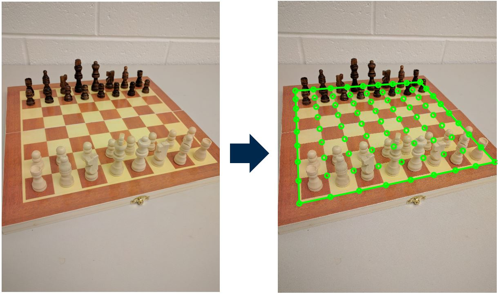

# Chessboard Recognition
Demo for the ICMV'17 paper "Geometry-Based Populated Chessboard Recognition"

   
   
# Abstract
Chessboards are commonly used to calibrate cameras, and many robust methods have been developed to recognize the unoccupied boards. However, when the chessboard is populated with chess pieces, such as during an actual game, the problem of recognizing the board is much harder. Challenges include occlusion caused by the chess pieces, the presence of outlier lines and low viewing angles of the chessboard. In this paper, we present a novel approach to address the above challenges and recognize the chessboard. The Canny edge detector and Hough transform are used to capture all possible lines in the scene. The k-means clustering and a k-nearest-neighbors inspired algorithm are applied to cluster and reject the outlier lines based on their Euclidean distances to the nearest neighbors in a scaled Hough transform space. Finally, based on prior knowledge of the chessboard structure, a geometric constraint is used to find the correspondences between image lines and the lines on the chessboard through the homography transformation. The proposed algorithm works for a wide range of the operating angles and achieves high accuracy in experiments.

# Usage
- Change the name of the board you want to test in 'main.m' file.
- Run 'main.m' to implement the populated chessboard recognition recognition.

# Citation
If you use our method and/or codes, please cite our paper

```
@inproceedings{xiegeometry,
  title={Geometry-Based Populated Chessboard Recognition},
  author={Xie, Youye and Tang, Gongguo and Hoff, William},
  booktitle={Tenth International Conference on Machine Vision (ICMV 2017)},
  year={2017},
  organization={International Society for Optics and Photonics}
}
```
